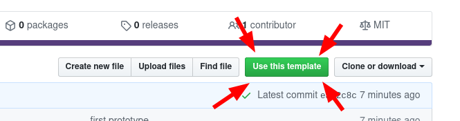
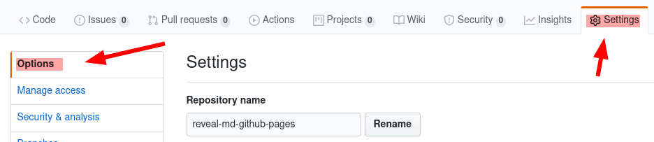

# reveal-md-github-pages

Use this template to automatically deploy your [reveal-md](https://github.com/webpro/reveal-md) presentations to github-pages.

## Demo

* see the example [here](https://gaerfield.github.io/reveal-md-github-pages/)

## Get started

* just press this nice & friendly green button

* give your new repo a name
* keep it public! (or git will deny to publish it)
* choose 'gh-pages' to be the public-branch by:
  * first switching to master
  * and then switching back to gh-pages
  * github-Bug? ¯\\_(ツ)_/¯

## writing content

* edit the markdown-file `slides.md`
* find all configurations on [reveal-md](https://github.com/gaerfield/reveal-md-github-pages)

## Customizations

* I changed a whee-bit the defaults
* custom.css:
  * has some additional configs (who needs borders around pictures)
  * just remove the content, if it not suits you
  * but keep the file, or the build will fail
* includes of markdown files
  * split up the presentation into multiple documents (useful for large presentations)
  * an include is defined by `{{path/to/include.md}}`
* embed small [plantuml](https://plantuml.com/)-diagrams into the presentation
* included scripts are configured in includes.js
  * clear the content, if customizations not needed (but keep the file!)

## view changes locally

* to view the presentation locally the start of a server is needed
* docker
  * a `docker-compose.yml` is part of the repository
  * call `docker-compose up` and open [http://localhost:1948/slides.md]
* npm
  * install reveal-md within repository `npm install reveal-md`
  * and then call `./node_modules/.bin/reveal-md --preprocessor includes.js --css custom.css slides.md`
  * the browser should open automatically
